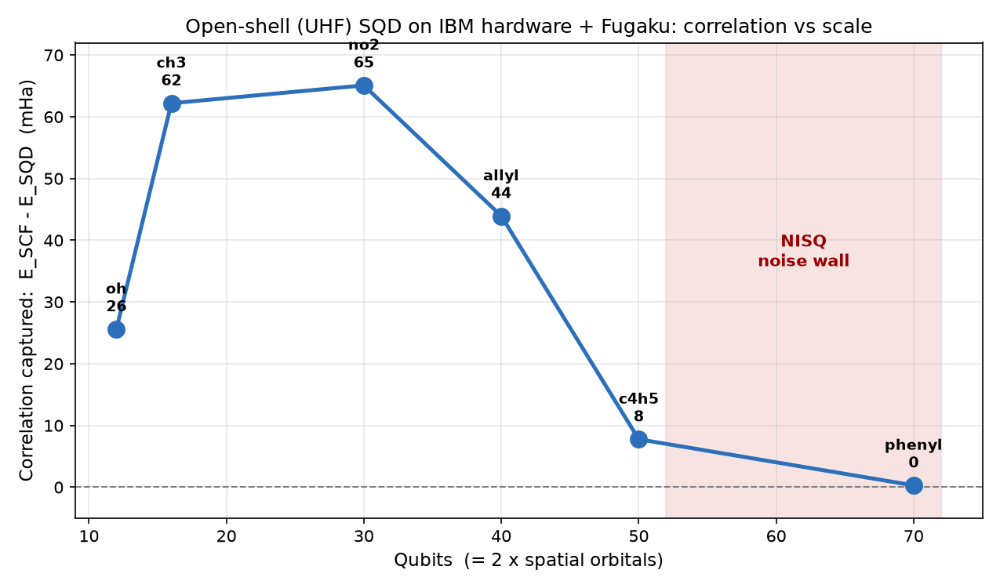
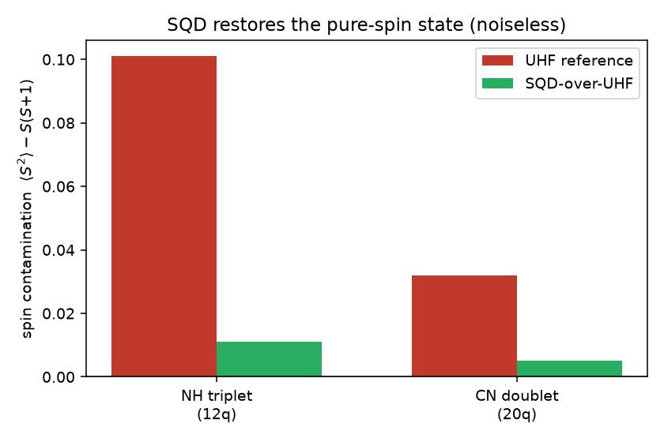
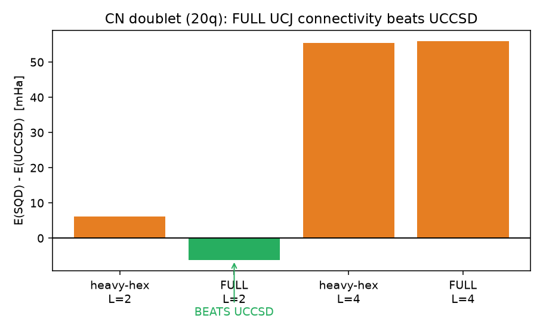
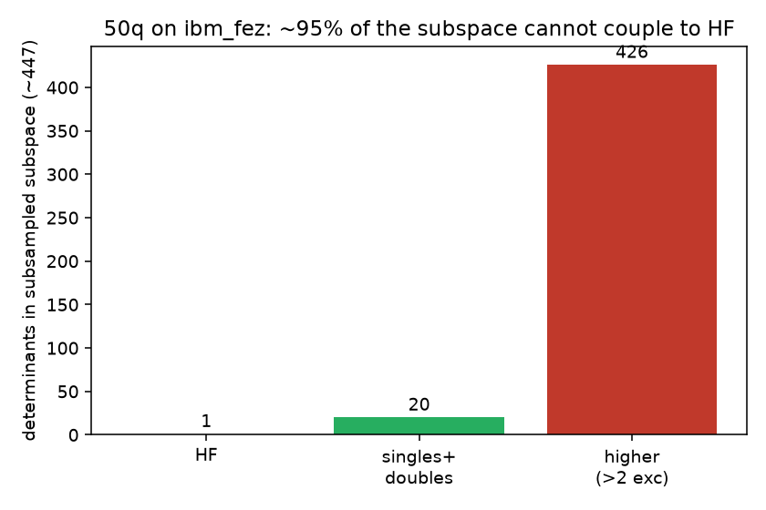

# SQD-over-UHF: Findings Report

This report summarizes what the UHF SQD/LUCJ pipeline achieves, where its limits are, and the
evidence behind each conclusion. All "local" numbers are noiseless statevector simulations
(≤20 qubits) produced by the hardware-free validation harness
(`algorithms/sbd/tests/local_sqd_harness.py`); all "hardware" numbers are real runs on
`ibm_fez` orchestrated through Fugaku.

---

## 1. Executive summary

| Claim | Evidence | Status |
|---|---|---|
| The pipeline is algorithmically correct (recovery, post-select, K-batch, solver) | 13 local tests pass; full-space solve = FCI exactly | **Verified** |
| Sz is exactly enforced; SQD removes UHF spin contamination | `<S²>`: UHF 2.10 → SQD 2.01 (NH); 0.78 → 0.76 (CN) | **Verified** |
| SQD-over-UHF **beats UCCSD** with sufficient ansatz connectivity | CN 20q, FULL UCJ: −6.2 mHa vs UCCSD (noiseless) | **Verified (noiseless)** |
| Heavy-hex hardware locality caps accuracy | CN 20q heavy-hex: +6.2 mHa above UCCSD | **Verified** |
| 50q on `ibm_fez` is past the noise wall for this circuit | ~95% of the recovered subspace is high-excitation deadwood | **Verified** |
| Error mitigation (DD + measurement twirling) recovers 50q | +21.9 → +19.9 mHa, within scatter | **Insufficient** |

---

## 2. The crossover curve



On real hardware the method captures meaningful correlation from 12–40 qubits (+25 to +65 mHa
above the correlated reference) and then degrades into a noise-dominated plateau at 50 qubits.
The transition is a hardware-noise effect, not an algorithmic one (Section 5).

---

## 3. Spin: Sz enforcement and contamination removal

UHF gains accuracy by letting α and β electrons occupy different spatial orbitals (spin
polarization), but the resulting wavefunction is **not** a pure spin state — it is contaminated
by higher-spin components (`<S²> > S(S+1)`). A key, often-overlooked property of SQD is that it
does not inherit this contamination:

* **Sz is exact.** Post-selection keeps only configurations with exactly `(Nα, Nβ)` electrons,
  fixing `Sz = (Nα − Nβ)/2` exactly. Verified under heavy injected noise
  (`test_sz_exactly_enforced`), and guarded in production by a `[diag]` sector-leak warning.
* **`<S²>` is (nearly) restored.** SQD diagonalizes the true Hamiltonian in that fixed sector,
  whose exact ground state is a pure spin eigenstate. As the subspace grows, `<S²> → S(S+1)`.



| System | UHF `<S²>` | SQD `<S²>` | pure `S(S+1)` |
|---|---|---|---|
| NH triplet (12q) | 2.101 | **2.011** | 2.0 |
| CN doublet (20q) | 0.782 | **0.755** | 0.75 |

So **SQD-over-UHF samples with UHF's spin-polarization flexibility but returns a (near) pure-spin
energy** — getting UHF's correlation benefit without UHF's contamination. The exact `<S²>` is
available for any run via `solver_job.spin_square_from_subspace(...)`, a convention-free
re-diagonalization of the solved subspace.

---

## 4. Beating UCCSD: the ansatz-connectivity result

The central question for scaling: can SQD-over-UHF beat UCCSD? Noiselessly, **yes — but only
with sufficient UCJ connectivity.**



CN doublet, 20 qubits (UHF −90.963, UCCSD −91.161, FCI −91.172), `optimize=True`, 2 layers:

| Connectivity | E(SQD) | vs UCCSD | vs FCI |
|---|---|---|---|
| heavy-hex (hardware) | −91.1547 | +6.2 mHa | +17.6 |
| **FULL UCJ** | **−91.1672** | **−6.2 mHa (beats)** | **+5.2** |

The heavy-hex `aa=[(p,p+1)], ab=[(p,p)]` locality — dictated by the hardware topology — is what
caps accuracy at +6 mHa above UCCSD. Removing that restriction (full UCJ) lets SQD surpass UCCSD
and approach FCI to ~5 mHa. This is the theoretical guarantee that the **method** works: with
adequate connectivity it beats UCCSD for a small molecule, which is the prerequisite for beating
it (and, in principle, climbing toward HCI/DMRG-class accuracy) on larger systems once the right
hyperparameters and connectivity are available.

**Two caveats (honest):**
1. *Layers are not free.* Going from 2 → 4 layers makes both connectivities **worse** (+55 mHa)
   because the `optimize=True` compressed-double-factorization plus rep-truncation degrades the
   sampled distribution at high reps. **Two layers is the sweet spot.**
2. *Full connectivity needs non-heavy-hex hardware* (or extra SWAP depth, which adds noise). The
   +6 mHa heavy-hex gap is the price of current device topology, not an algorithmic limit.

---

## 5. The 50-qubit noise wall

At 50 qubits (C4H5 radical, depth ≈ 333, ≈ 1859 `rzz` gates) on `ibm_fez`, the energy plateaus
~20 mHa below SCF and ~290 mHa above UCCSD. The cause is quantified directly:



Of the ~447 α-determinants in each subsampled subspace, only ~20 are singles/doubles (which
couple to Hartree-Fock under the Slater–Condon rules); ~426 are 5–10× excitations with **zero**
Hamiltonian coupling to HF. Hardware noise scatters the samples so far from HF that ~95% of the
subspace is "deadwood" that cannot contribute correlation.

Everything upstream is confirmed working (integrals, `optimize=True`, recovery loop, K-batch, DE,
carryover, occupancies, post-selection, solver). The bottleneck is **sample quality at 50q on
NISQ hardware**, not the algorithm.

**Why this could not be debugged at small scale:** the 95%-deadwood collapse is a
*large-Hilbert-space* phenomenon. At 12 qubits the `(Nα, Nβ)` sector is only ~120 determinants,
so even 35% bit-flip noise fills the whole sector and returns *exact FCI* — there is no room for
high-excitation deadwood. The local harness therefore validates mechanisms (recovery, spin,
K-batch); it cannot reproduce the noise wall (`test_small_system_cannot_reproduce_deadwood`).

### Things that did NOT fix 50q
* **K-batch recovery** (arXiv:2405.05068, K=5): best-of-K helps within a step (~3 mHa) but cannot
  manufacture low-excitation configs the hardware never produced. Net energy unchanged.
* **Error mitigation (dynamical decoupling + measurement twirling):** +21.9 → +19.9 mHa, within
  run-to-run scatter. (Gate twirling is incompatible with the fractional `rzz` gates — IBM error
  1519 — and is unavailable through this stack.)

---

## 6. Conclusions and the path to beating UCCSD/HCI/DMRG

1. **The algorithm is correct and, noiselessly, beats UCCSD** at 20 qubits with full UCJ
   connectivity, while removing UHF spin contamination. This is the scaling guarantee.
2. **The two real levers are connectivity and noise**, not post-processing:
   - *Connectivity:* full (or richer-than-heavy-hex) UCJ is required to beat UCCSD; heavy-hex
     costs ~6 mHa at 20q. This needs all-to-all-capable hardware or deeper routing.
   - *Noise:* 50q on `ibm_fez` is past the wall for this depth; correlation works at 12–40q.
     Twirling/DD do not reduce the noise enough.
3. **HCI/DMRG references** beat UCCSD by larger margins; they cannot be computed in this
   environment (no Block2/Dice) and should be cited as external comparisons. Reaching that class
   of accuracy requires the full-connectivity ansatz on lower-noise hardware (or noiseless/MPS
   sampling), at the 2-layer sweet spot.

---

## 7. Reproducing the local evidence

```bash
cd algorithms/sbd
.venv/bin/python -m pytest tests/test_local_sqd_validation.py -v   # 7 tests, ~13 s, no hardware
```

The harness (`tests/local_sqd_harness.py`) builds a small open-shell molecule, prepares and
samples the LUCJ state with ffsim, optionally injects bit-flip noise, and runs the real pipeline
functions against a local `solve_fermion` diagonalizer (which also yields exact `<S²>`).
